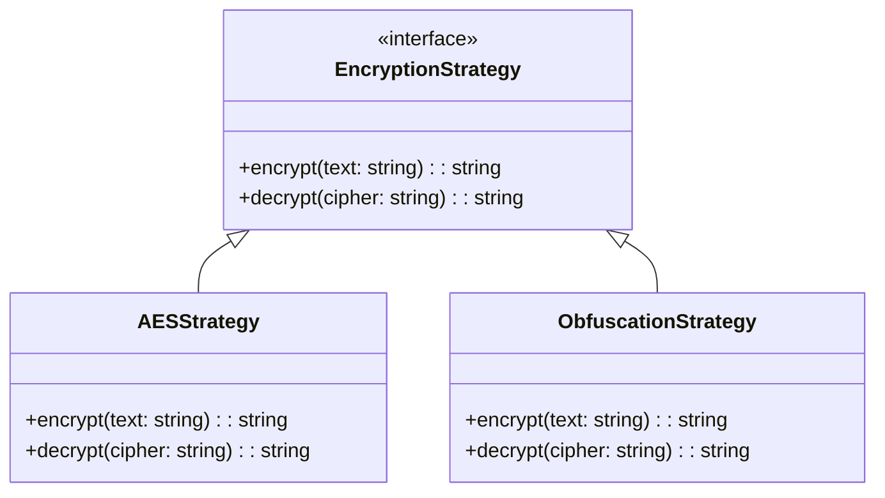

# System Design Specification: PatternMaster

This document provides a production-grade System Design Specification for the PatternMaster system. It outlines functional requirements, scaling mathematics, OIDC authentication, secure database encryption, high-availability system layouts, and mitigation strategies for single points of failure.

---

## 1. Requirements

### Functional Requirements
1. **User Auth & Profiles**: Users must securely log in using OpenID Connect (OIDC / Google OAuth2) and manage preferred languages.
2. **Progress Tracking**: Users can view, search, and toggle problem statuses (`unsolved`, `solved`, `needs-revision`).
3. **AI Mentor Explanations**: Generate and cache structured, detailed explanations for DSA problems using the Gemini API.
4. **Smart Recommendations**: Suggest next tasks to solve based on active status, revision needs, and days since last practice.
5. **Data Synchronization**: Synchronize local device progress with cloud storage when online.

### Non-Functional Requirements
1. **High Availability**: Target `99.99%` uptime (SLA).
2. **Low Latency**: Endpoints (excluding Gemini LLM generation) must serve responses under **100ms** (p99).
3. **Security**: Hardware-backed credential encryption on-device, AES-256 transparent database encryption, and HTTPS TLS 1.3 in-transit.
4. **Scalability**: Seamlessly handle **10 million Daily Active Users (DAU)**.
5. **Accuracy**: Strict transactional consistency on critical progress updates (prevent double attempt counts).

---

## 2. Use Case Diagram

```mermaid
left_to_right_direction
actor User as "User (Mobile Client)"
actor OIDC as "Identity Provider (Google/OIDC)"
actor LLM as "Gemini AI API"

rectangle System {
    usecase UC1 as "Sign In / Onboard"
    usecase UC2 as "Practice Problems & Track Progress"
    usecase UC3 as "View Personalized Recommendations"
    usecase UC4 as "Request AI Mentor Explanations"
    usecase UC5 as "Sync Progress to Cloud"
}

User --> UC1
User --> UC2
User --> UC3
User --> UC4
User --> UC5

UC1 --> OIDC : "Verify Token"
UC4 --> LLM : "Generate Explanation"
```

---

## 3. Capacity Estimation

Let us calculate bounds for **10 Million Daily Active Users (DAU)**.

### Storage Estimation (Data at Rest)
- **User Profile Record**:
  - `userId` (36B UUID) + `userName` (50B) + `email` (50B) + `preferredLanguage` (10B) + timestamps (16B) = **~162 Bytes**
- **User Progress Record** (avg 240 problems tracked per user):
  - Per problem progress: `problemId` (12B) + `status` (10B) + `attemptCount` (4B) + `lastSolvedAt` (8B) + `revisionCount` (4B) + `masteryLevel` (4B) + timestamps (16B) = **58 Bytes**
  - Total progress per user: $240 \times 58 \text{ Bytes} \approx 13.9 \text{ KB}$
- **Total Storage per active user**: $\approx 14 \text{ KB}$
- **Total Storage (10M DAU)**:
  \[10,000,000 \times 14 \text{ KB} = 140,000,000 \text{ KB} \approx 140 \text{ GB (Excluding Index overhead)}\]
  - Allocating $2.5\times$ multiplier for indexing, replication log overhead, and metadata, we require **~350 GB** database cluster space.

### Throughput & QPS (Queries Per Second)
- **Onboarding/Login rate** (Assume 10% of DAU log in daily, skewed over a peak 4-hour window):
  - Peak Login Volume = $1,000,000 \text{ logins}$
  - Peak Login QPS = $\frac{1,000,000}{4 \times 3600} \approx \mathbf{70 \text{ QPS}}$
- **API Traffic** (Sync / recommendations requests; average 5 writes and 15 reads per user session):
  - Total Writes/day = $50,000,000 \text{ writes}$
  - Total Reads/day = $150,000,000 \text{ reads}$
  - Peak traffic multiplier = $3\times$ average load.
  - Average QPS = $\frac{200,000,000 \text{ queries}}{86,400 \text{ seconds}} \approx 2,315 \text{ QPS}$
  - Peak QPS = $2,315 \times 3 \approx \mathbf{7,000 \text{ QPS}}$ (5,250 Read QPS, 1,750 Write QPS)

---

## 4. API Gateway Design

The API Gateway is the single entry point for client requests, sitting in front of microservices.

```
[Clients] ---> [API Gateway (Nginx / Kong)] ---> [Load Balancers] ---> [Services]
```

### Gateway Responsibilities
1. **Routing**: Matches path prefixes (e.g. `/api/v1/auth/*` -> Auth Service, `/api/v1/sync/*` -> Sync Service).
2. **Authentication**: Resolves OIDC `Authorization: Bearer <JWT>` header using local JWKS caching.
3. **Rate Limiting**: Checks Redis token bucket to reject clients exceeding limits.
4. **Latency & Timeout Controls**: Rejects sluggish downstream responses (Gateway timeout 30s for Gemini API, 5s for internal APIs).
5. **Observability & Logging**: Captures HTTP status, upstream latency, IP addresses, and request identifiers.

---

## 5. Authentication Method: OIDC PKCE Flow

For native/mobile environments, client credentials cannot be stored securely. We enforce OIDC Authorization Code Flow with PKCE:

```
[Mobile App] ------------( 1. Open Authorization View )------------> [OIDC IDP]
[Mobile App] <-----------( 2. Callback with Auth Code )------------- [OIDC IDP]
     |
     +---( 3. Token Exchange with Verifier + Auth Code )-----> [OIDC Token Endpoint]
[Mobile App] <-----------( 4. Access + ID + Refresh Tokens )--------- [OIDC Token Endpoint]
     |
     +---( 5. Securely Saves Tokens in Device Keychain )
```

- **JWT Validation**: APIs cryptographically verify the signature (`RS256`) against Google's public key (JWKS) and validate `iss` (Issuer), `aud` (Audience), and `exp` (Expiration) claims.

---

## 6. Object Design & Patterns

To support cross-platform capabilities and clear responsibilities, we employ the following patterns:

### Strategy Pattern (Encryption Ciphers)
Decouples encryption algorithms from database storage handlers, allowing seamless swapping of ciphers (e.g., swapping AES for ChaCha20 without modifying database operations).



### Repository Pattern (Database Abstraction)
Hides low-level SQLite / SQLite-SQLCipher query complexities behind domain-driven APIs:
- `ProfileRepository.getProfile(): Promise<UserProfile>`
- `ProgressRepository.saveProgress(prog: UserProgress): Promise<void>`

---

## 7. Database Design & Indexing

To handle multi-tenant cloud storage, we use a relational SQL schema (e.g., PostgreSQL for cloud sync, SQLite for local device caching).

### Database Schema

#### `profile` Table
| Column Name | Data Type | Key Type | Constraints |
| :--- | :--- | :--- | :--- |
| `userId` | VARCHAR(128) | Primary Key | NOT NULL |
| `userName` | TEXT | | (Encrypted in database) |
| `preferredLanguage` | VARCHAR(32) | | DEFAULT 'Python' |
| `hasCompletedOnboarding` | BOOLEAN | | DEFAULT FALSE |
| `createdAt` | BIGINT | | |
| `updatedAt` | BIGINT | | |

#### `progress` Table
| Column Name | Data Type | Key Type | Constraints |
| :--- | :--- | :--- | :--- |
| `userId` | VARCHAR(128) | Composite PK | NOT NULL, Foreign Key |
| `problemId` | VARCHAR(128) | Composite PK | NOT NULL |
| `status` | VARCHAR(32) | | NOT NULL (unsolved/solved/needs-revision) |
| `attemptCount` | INT | | DEFAULT 0 |
| `lastSolvedAt` | BIGINT | | |
| `revisionCount` | INT | | DEFAULT 0 |
| `masteryLevel` | INT | | DEFAULT 0 |

### Indexing Optimization
- **`idx_progress_lookup`**: Composite index on `(userId, problemId)` to fetch progress instantly during rendering.
- **`idx_progress_status_mastery`**: Composite index on `(userId, status, masteryLevel DESC)` to run fast query sorting for recommended problems.

---

## 8. Caching Strategy (Redis)

To handle 5,250 Read QPS without hitting primary database boundaries, we employ **Redis caching**.

### Cache Patterns
- **Cache-Aside Pattern**:
  - Application checks cache by key `user:profile:<userId>`.
  - If Cache Hit: Return cached object.
  - If Cache Miss: Query database, write data to Cache, and set time-to-live (TTL).
- **TTL Configuration**: Set TTL of **15 minutes** for dynamic profile data to maintain consistency while avoiding database load.
- **Cache Eviction Policy**: **Volatile-LRU** (Least Recently Used with TTL set) prevents memory overflow on Redis instances.

---

## 9. Communication Protocols

1. **REST (HTTP/JSON)**: Client-to-API-Gateway interactions. Simple, universally supported, and browser-compliant.
2. **gRPC (HTTP/2 over TCP)**: High-performance inter-microservice communication. Employs Protocol Buffers (protobufs) for compact payloads and low latency.
3. **WebSockets (TCP)**: Optional persistent connection for real-time synchronization updates between client devices.

---

## 10. Concurrency & Locking

In multi-device setups, race conditions occur when a user solves a problem concurrently on two devices, resulting in inconsistent progress states.

### Optimistic Locking
- We add a `version` column to the `progress` table.
- When saving:
  ```sql
  UPDATE progress 
  SET status = 'solved', version = version + 1 
  WHERE userId = :userId AND problemId = :problemId AND version = :expectedVersion;
  ```
- If the rows affected is `0`, a write collision occurred. The system rejects the stale sync and triggers client reconciliation.

---

## 11. Load Balancing

To scale horizontally and prevent a single point of failure (SPOF):

1. **DNS Load Balancing (Cloudflare)**: Performs geographic routing (GSLB) to route traffic to the nearest regional data center.
2. **Layer 7 Load Balancing (Application Load Balancer - ALB)**:
  - Terminates TLS sessions.
  - Inspects HTTP headers, routing calls based on request path.
  - **Algorithms**: Weighted Least Connections algorithm directs traffic away from busy servers to low-utilization nodes.

---

## 12. Redis Token Bucket Rate Limiting

To enforce rate limits, we execute an atomic Lua script in Redis implementing the **Token Bucket** algorithm:

```lua
local key = KEYS[1]
local limit = tonumber(ARGV[1])
local capacity = tonumber(ARGV[2])
local refill_rate = tonumber(ARGV[3]) -- tokens per millisecond
local now = tonumber(ARGV[4])

local data = redis.call('HMGET', key, 'tokens', 'last_refill')
local tokens = tonumber(data[1])
local last_refill = tonumber(data[2])

if not tokens then
    tokens = capacity
    last_refill = now
else
    local elapsed = now - last_refill
    tokens = math.min(capacity, tokens + elapsed * refill_rate)
    last_refill = now
end

if tokens >= 1 then
    tokens = tokens - 1
    redis.call('HMSET', key, 'tokens', tokens, 'last_refill', last_refill)
    redis.call('EXPIRE', key, 900) -- expire after 15 mins
    return 1 -- Allowed
else
    redis.call('HMSET', key, 'tokens', tokens, 'last_refill', last_refill)
    return 0 -- Rejected (Rate limited)
end
```

---

## 13. Security Protocols

1. **Data in Transit**: HTTPS with **TLS 1.3** and strict HSTS (HTTP Strict Transport Security).
2. **SQL Injection Protection**: Strict parameterized queries and ORM mappings.
3. **CORS Policies**: Explicit origin pinning to block cross-origin browser exploits.
4. **Input Sanitization**: Rejects malformed JSON schemas at the gateway level.

---

## 14. Availability & Redundancy (SPOF Elimination)

To guarantee high availability and eliminate Single Points of Failure:

| Potential SPOF | Redundancy Strategy |
| :--- | :--- |
| **API Server Failure** | Multi-Instance deployment behind an ALB across multiple Availability Zones (AZs). |
| **Primary Database Outage** | Multi-AZ replication with automatic failover (AWS Aurora RDS). |
| **Identity Provider Outage** | JWT credentials verification with local JWKS caching (continues verifying sessions even if the IDP is temporarily down). |
| **API Gateway Failure** | Active-Active gateway setup (e.g. AWS API Gateway / multiple Kong instances in distinct routing layers). |

---

## 15. SLA, SLI, and SLO Targets

- **Service Level Indicator (SLI)**: Ratio of successful responses to total valid requests.
- **Service Level Objective (SLO)**: `99.9%` of requests must respond under 100ms (excluding Gemini LLM calls).
- **Service Level Agreement (SLA)**: `99.99%` system availability per billing cycle.

---

## 16. Trade-offs & CAP Theorem

### CAP Theorem Trade-off: Consistency vs. Availability
- In database sync architectures, when a network partition occurs (a client loses connectivity):
  - **Availability Over Consistency (AP)**: We choose Availability. The mobile client allows offline problem solving and local SQLite changes.
  - **Resolution**: Once connection resumes, a reconciliation resolver merges progress updates sequentially, ensuring eventual consistency.

### Database Selection: SQL vs. NoSQL
- We chose **Relational SQL** (PostgreSQL/SQLite) for progress tracking:
  - **Pros**: Strong ACID guarantees prevent duplicate solves and incorrect metrics calculations.
  - **Cons**: Scaling writes requires partition shading.
- For AI Explanation caching, a NoSQL Document Store (or KV Cache) is preferred due to flat, high-throughput text access needs.
